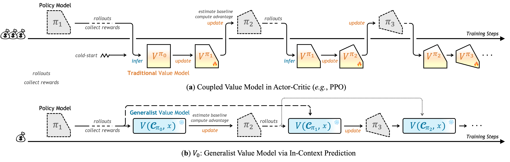
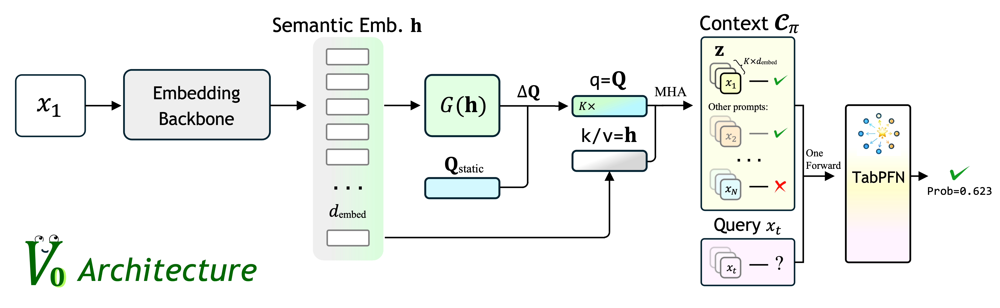

# V<sub>0</sub>: A Generalist Value Model for Any Policy at State Zero

<p align="center">
  <a href="https://arxiv.org/abs/2602.03584"></a>
  <a href="https://github.com/Now-Join-Us/V0"></a>
  <a href="https://huggingface.co/spaces/Now-Join-Us/Generalist-Value-Model-V0"></a>
</p>

V<sub>0</sub> is a **Generalist Value Model** designed to predict the expected performance of any model on unseen instructions without requiring parameter updates or additional rollouts. By treating a policy's dynamic capability as explicit context, V<sub>0</sub> serves as an efficient resource scheduler for LLM training and deployment.


## 💡 Overview

> **Function:** V<sub>0</sub> uses a model's historical performance to predict how it will perform on unseen instructions without running the model itself.

In the context of RLHF and LLM alignment (e.g., PPO or GRPO), value models are typically coupled to a specific policy. V<sub>0</sub> breaks this paradigm by:
* **State Zero Estimation:** Focusing on the initial prompt to predict success rates before generation.
* **Dynamic Profiling:** Using instruction-performance pairs to perceive capability shifts without retraining.
* **Resource Scheduling:** Optimizing sampling budgets in GRPO and acting as an intelligent router during deployment.




## Method

The V<sub>0</sub> architecture consists of a **Semantic Backbone** for embedding extraction and a **Residual Query Adapter** that integrates static and dynamic queries. These features are processed by a **TabPFN inference head** to generate value predictions.




## 🚀 Getting Started

### Installation

Clone the repository and install the dependencies:

```bash
git clone https://github.com/Now-Join-Us/V0.git
cd V0
pip install -r requirements.txt
```

### Training

```bash
python main_train.py
```

### Evaluation & Demo

To launch the local demo:

```bash
python demo.py
```

---

## 📖 Citation

If you find V<sub>0</sub> useful in your research, please cite our work:

```bibtex
@article{generalist_value_model_v0,
  author       = {Yi-Kai Zhang and Zhiyuan Yao and Hongyan Hao and Yueqing Sun and Qi Gu and Hui Su and Xunliang Cai and De-Chuan Zhan and Han-Jia Ye},
  title        = {V0: A Generalist Value Model for Any Policy at State Zero},
  journal      = {CoRR},
  volume       = {abs/2602.03584},
  year         = {2026}
}
```
